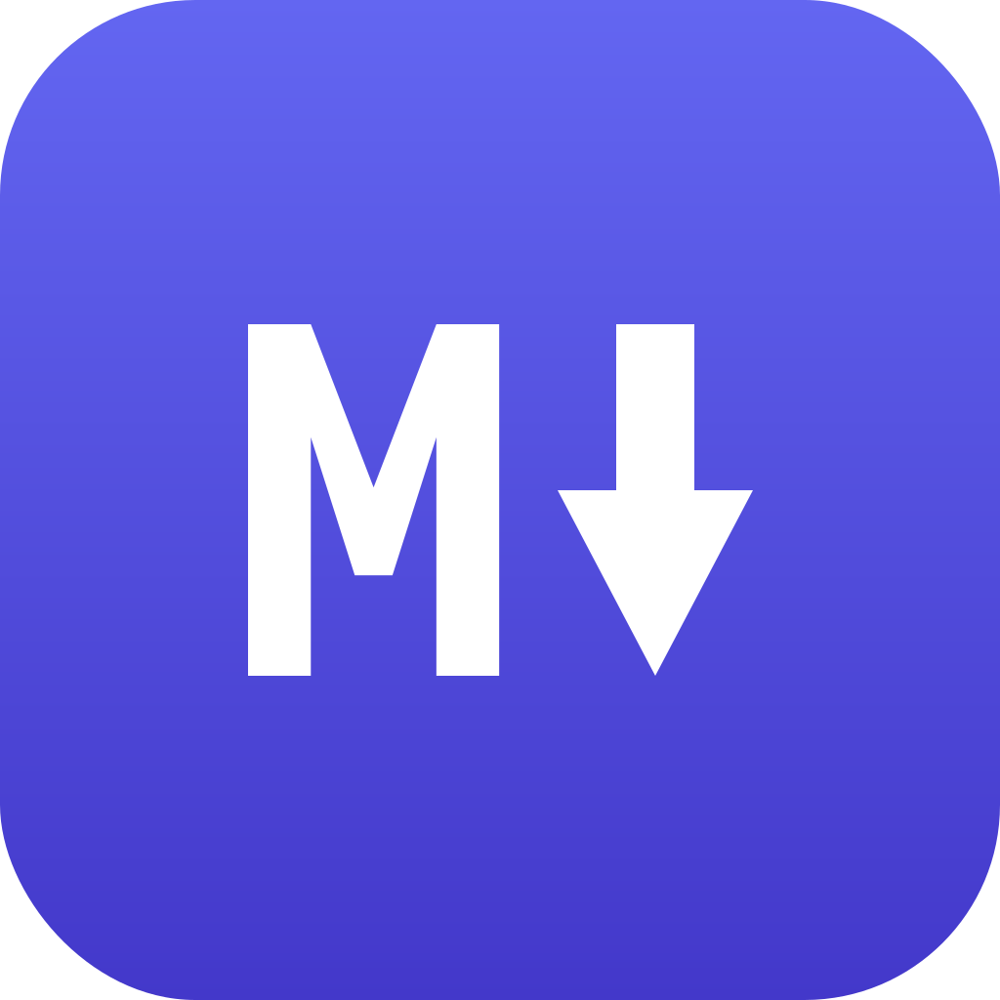
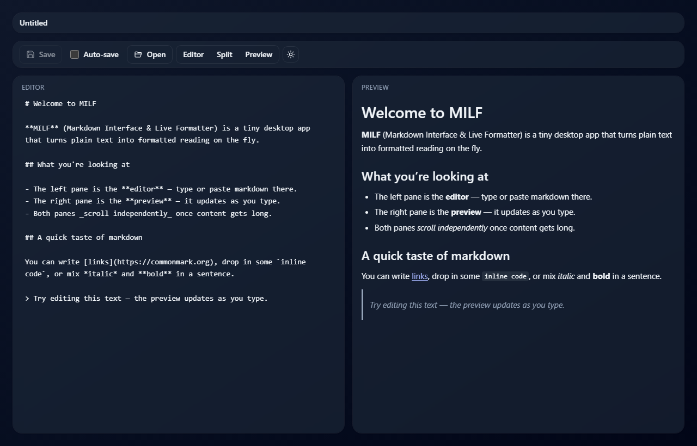

<p align="center">
  
</p>

<h1 align="center">markpad</h1>

<p align="center">
  <strong>A lightweight, cross-platform Markdown editor with live preview.</strong>
</p>

<p align="center">
  Edit Markdown on the left, see it rendered on the right — with a recent-files<br>
  sidebar, a formatting toolbar, light/dark theming, auto-save, and OS file-association<br>
  handling, in a small native <code>Tauri</code> app for Windows, Linux, and macOS.
</p>

<p align="center">
  <a href="https://github.com/lezli01/markpad/actions/workflows/ci.yml"></a>
  <a href="https://github.com/lezli01/markpad/releases"></a>
  <a href="LICENSE"></a>
  <a href="https://www.buymeacoffee.com/lezli01"></a>
</p>

<p align="center">
  <a href="#why-markpad">Why</a> &bull;
  <a href="#features">Features</a> &bull;
  <a href="#quick-start">Quick Start</a> &bull;
  <a href="#contributing">Contributing</a> &bull;
  <a href="docs/architecture.md">Architecture</a>
</p>

---



## Why markpad?

Most Markdown editors ask for a tradeoff: a heavyweight Electron app that ships a
whole browser to render a text file, a web app that wants your documents in the
cloud, or a bare editor with no live preview at all.

markpad is the small, local-first alternative — a native desktop app that opens
quickly, keeps every file on your machine, and shows your Markdown rendered side
by side as you type. A recent-files sidebar, a one-click formatting toolbar,
light/dark theming, optional auto-save, and real OS file-association handling make
it usable day to day, without the bloat.

It is released under the [MIT License](LICENSE) and created by `lezli01` at
[lezli01.is-a.dev](https://lezli01.is-a.dev). Contributions are welcome — see
[Contributing](#contributing).

## Features

Open a `.md` file and markpad treats editing and previewing as first-class,
side-by-side work:

- **Live split-pane preview.** Edit Markdown on the left, see it rendered on the right, with each pane scrolling independently.
- **Formatting toolbar.** One-click Markdown formatting from the editor header — bold, italic, strikethrough, inline code, headings, bullet/numbered lists, quotes, links, images, code blocks, tables, and horizontal rules — with shortcuts for the common ones (`Ctrl/⌘+B`, `+I`, `+E`, `+K`, and more). Buttons toggle the mark off when reapplied and light up to show the formatting at the cursor.
- **Three view modes.** Editor-only, preview-only, or side-by-side — switch at any time without losing the editor's content, selection, or undo history.
- **Recent files sidebar.** A left-hand panel lists up to 50 recently opened items — most-recent first, with modified files pinned to the top and marked. Click one to open it; modified and untitled documents keep their unsaved edits, cursor, and scroll position.
- **Collapsible, resizable sidebar.** Drag the divider to resize the recents panel, or hide it entirely for distraction-free writing with the toolbar toggle or `Ctrl+\`; the width and collapsed state persist.
- **New empty file.** Start a fresh Markdown document from the toolbar or `Ctrl+N` / `⌘N`; it appears in the recents list as an untitled draft, and the first Save prompts for a path.
- **Light and dark theme.** Honors the operating system's appearance preference by default, with a manual toggle in the toolbar.
- **Open files from disk.** Native file picker biased toward `.md` and `.markdown`, with a fallback to all files.
- **Open files from your file manager.** Set markpad as the default for `.md` and a double-click opens markpad (or routes to the running instance).
- **One window per user.** markpad runs as a single instance; new file requests bring the existing window to the foreground.
- **Save back to disk.** Manual Save plus a visible modified indicator in the recents list so you always know whether your edits are on disk.
- **Optional auto-save.** Tick the box once and edits land on disk shortly after you stop typing, while a file is open.
- **Unsaved-change guard.** A file is never closed — only removed from the recents list. Removing an item that has unsaved edits prompts to Save, Discard, or Cancel so reflex clicks don't lose work.
- **Resumes where you left off.** Your recent-files list and the active document are restored on launch — including unsaved drafts and untitled documents, whose contents are saved locally so edits survive a restart. Files that have been moved or deleted are dropped when reopened.
- **Persistent preferences.** Theme, view mode, auto-save, and the sidebar's width and collapsed state are remembered between launches, stored locally.
- **Responsive layout.** Side-by-side on a normal window, stacks vertically at narrow widths.
- **Safe preview.** Rendered HTML is sanitized with DOMPurify before display.

## Built With

- [Tauri 2](https://tauri.app/) — native desktop shell and filesystem access
- [React 19](https://react.dev/) + [TypeScript](https://www.typescriptlang.org/)
- [Vite](https://vitejs.dev/) — dev server and build
- [CodeMirror 6](https://codemirror.net/) — editor
- [markdown-it](https://github.com/markdown-it/markdown-it) — Markdown rendering
- [DOMPurify](https://github.com/cure53/DOMPurify) — preview sanitization
- [Tailwind CSS](https://tailwindcss.com/) — styling

For a high-level overview, see [`docs/architecture.md`](docs/architecture.md).

## Quick Start

Prerequisites: Node.js LTS, npm, Rust + Cargo, and Tauri 2's
[platform prerequisites](https://v2.tauri.app/start/prerequisites/) for your OS.

Install dependencies:

```sh
npm ci
```

Launch the desktop app:

```sh
npm run tauri dev
```

Or run just the frontend in a browser:

```sh
npm run dev
```

## Development Checks

Frontend:

```sh
npm run lint
npm run build
```

Rust / Tauri (from `src-tauri/`):

```sh
cargo fmt --all --check
cargo clippy --all-targets --all-features -- -D warnings
cargo check --all-targets --all-features
```

## Project Layout

```text
src/             React + TypeScript UI (editor, preview, workspace, toolbar, recents panel)
src-tauri/       Rust crate that hosts the Tauri desktop runtime
specs/           Feature specifications (one folder per feature)
docs/            Architecture notes and supporting docs
```

## Privacy

markpad is local-first. Files stay on your machine and the application does not
send your content over the network. Preferences are stored in the local browser
storage of the desktop runtime. Session state — your recent-files list, the active
document, and any unsaved drafts — is stored locally in your platform's standard
application-data directory; nothing is sent over the network.

## Project Status

Early development, but already usable day-to-day. The split-pane workspace, the
recent-files sidebar with draft persistence, file open/save, view modes, theming,
auto-save, OS file-association handling, single-instance routing, and session
restore are working today. Specs for shipped and in-progress features live under
[`specs/`](specs); open issues and follow-ups are in the
[issue tracker](https://github.com/lezli01/markpad/issues).

## Contributing

Contributions of every size are welcome — bug reports, docs, new features, and
test cases. markpad is spec-driven and intentionally contributor-friendly: every
meaningful feature begins with a short spec under [`specs/`](specs) and clear
acceptance criteria before implementation. Start here:

- Read the [Contributing guide](CONTRIBUTING.md) for development setup, the
  issue-to-PR workflow, and the checks expected before a pull request.
- Be a good neighbor: this project follows a
  [Code of Conduct](CODE_OF_CONDUCT.md).
- Have a question or an idea? Open a
  [Discussion](https://github.com/lezli01/markpad/discussions).
- Found a bug or want a feature? Open an
  [issue](https://github.com/lezli01/markpad/issues/new/choose).

Releases are automated with
[release-please](https://github.com/googleapis/release-please), so pull requests
use [Conventional Commits](https://www.conventionalcommits.org/) titles. Details
are in [CONTRIBUTING.md](CONTRIBUTING.md).

## Security

markpad is local-first and sanitizes all rendered HTML before display, so its
attack surface is small — but security reports are taken seriously. Please do not
open a public issue for suspected vulnerabilities; report them privately via
GitHub's private vulnerability reporting for this repository. See
[SECURITY.md](SECURITY.md) for details.

## License

`markpad` is released under the [MIT License](LICENSE). © 2026 lezli01.
